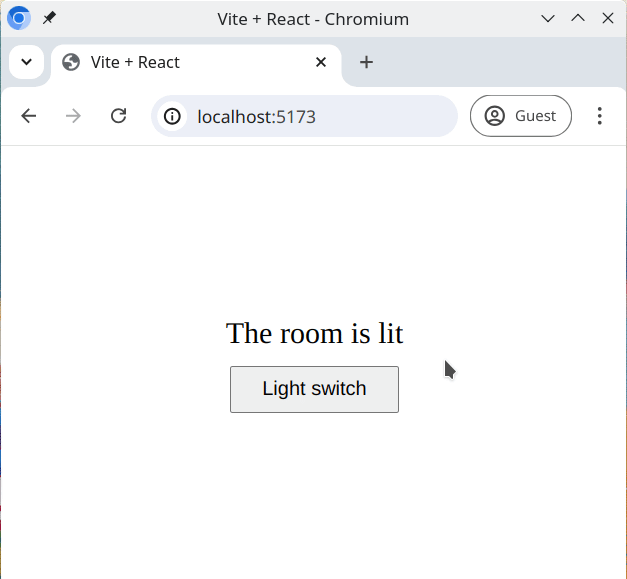

# Light Switch  (React)

The **Light Switch** project demonstrates how React's state management works in a simple and interactive way. It simulates a room with a light, controlled by a switch. By using the `useState` hook, the light can be toggled on and off, and the background color of the room changes depending on the light's state.

## Features of the Project

This project involves building a simple interactive component that mimics a light switch inside a room. It features:

- **Light Toggle**: A button that toggles the light between "on" and "off".
- **State Management**: The state of the light (on or off) is stored using the `useState` hook.
- **Dynamic Text**: The text dynamically changes based on the state of the light to indicate whether the room is bright or dark.
- **CSS Styling**: The background color of the room changes according to the light's state. When the light is on, the room background becomes brighter, and when the light is off, it becomes dark.

## How It Works

- The project starts with a room that has a light controlled by a button.
- The state of the light is stored as a boolean value using React’s `useState` hook.
- When the button is clicked, it toggles the light on and off.
- Based on whether the light is on or off, the room's background changes, and the text updates to either "The room is bright" or "The room is dark".

## What You'll Learn

This project will give you hands-on experience with React state and event handling. It is a great way to learn:

- How to use the `useState` hook to manage the state of an element.
- How to update the UI based on state changes.
- How to conditionally render styles and text based on state.

## The Expected Result

In the final version of the project, when you click the light switch button, it will toggle the light on and off. When the light is on, the room’s background color will change to a bright color, and the text will say "The room is bright". When the light is off, the background will darken, and the text will say "The room is dark".

Here’s a preview of the expected behavior:



## How to Run the Project

To run this project locally on your computer, follow these steps:

## Getting Started
1. Clone the repository to your local machine:
  ```bash
   git clone <repository-url>
  ```
  2. Navigate to the project folder
  ```bash
   cd <directory-name>
  ```
  3. Install dependencies
  ```bash
   npm install
  ```
  4. Start the development server
   ```bash
   npm run dev
  ```
  5. Open your browser \
     The app will open in your default browser, typically at:
  ```bash
  Local: http://localhost:5173/

